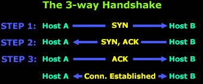

<h1 style="color: yellow">Mô hình TCP/IP</h1>

1. Tầng ứng dụng: DNS, DHCP, FTP, HTTPS, IMAP, LDAP, NTP, POP3, RTP, RTSP, SSH, SIP, SMTP, SNMP, Telnet, TFTP.
2. Tầng vận chuyển: TCP, UDP.
3. Tầng mạng: ICMP, IGMP, IPSec, IPv4, IPv6, IPX, RIP.
4. Tầng liên kết: Bluetooth, Ethernet, DSL, ISDN, 802.11, Wifi.

<h1 style="color: yellow">So sánh OSI và TCP/IP</h1>

| OSI | TCP/IP |
|:----:|:-----:|
|- Mô hình lý thuyết, sử dụng hệ thống máy tính |- Mô hình client - sever, truyền dữ liệu qua internet |
|- Phát triển mô hình -> giao thức|- Thiết kế giao thức -> phát triển mô hình|
|- Các tầng độc lập nhau|- Tầng 2 và 3 kết hợp|
|- Giao thức độc lập|- Phụ thuộc vào giao thức|

<h1 style="color: yellow">UDP và TCP</h1>

| UDP | TCP |
|:----:|:---:|
|- Giao thức không kết nối, truyền ngay lập tức: không tin cậy|- Giao thức hướng kết nối (bắt tay 3 bước): tin cậy, đảm bảo dữ liệu từ nguồn đến đích|
|- Cấu trúc phần đầu đơn giản|- Header phức tạp|
|- Phù hợp ứng dụng thời gian thực: game, live,..,|- Phù hợp với ứng dụng: Web,...|

<h1 style="color: yellow">Giao thức bắt tay 3 bước</h1>

- Cờ 1: SYN: bắt đầu quá trình bắt tay 3 bước.
- Cờ 2: ACK: Xác nhận bản tin nhận.
- Cờ 3: FIN: Cờ thông báo ngắt kết nối.
- Cờ 4: Reset (RST): Cờ yêu cầu truyền lại.
- Cờ 5, 6: Urgent Pointer & Push: Xử lý gói tin.

- SYN Packet là gửi từ các cổng cao (1024 - 65535) của máy con đến những cổng trong vùng thấp (1 - 1023) của máy chủ.

- Các cổng từ 1024 -> 65535:
    + 23 Telnet
    + 255 - STMP
    + 80 - HTTP
    + 53: Domain Name Sever
- Sever nhận SYN cổng nào thì gửi lại ACK cổng đó.
