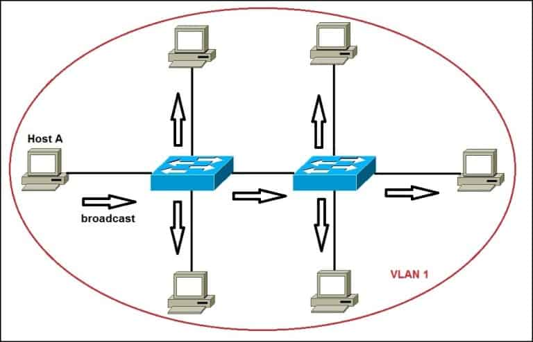

<h1 style="color: red">1. Khái niệm về VLAN</h1>

VLAN (Virtual LAN) là một hay nhiều LAN ảo luận lý được chia ra từ một Switch vật lý có tính chất tương tự như một switch vật lý. Nói cách khác VLAN là chia một switch vật lý thành nhiều switch logic độc lập.

Để các host cùng VLAN của 2 switch có thể giao tiếp được nhau. 2 VLAN này phải được đấu nối với nhau.

Mỗi một VLAN được ảo ra từ một Switch cũng như một logical switch. Còn trong một hệ thống mạng LAN thì VLAN là một broadcast domain gồm nhiều logical switch kết nối với nhau.

<h2 style="color: red">Dải giá trị VLAN-ID chạy từ 0 – 4095:</h2>

– 1 – 1001 : dải VLAN thường được sử dụng.
– 1002 – 1005 : dải này dùng để giao tiếp với các kiểu mạng LAN khác.
– 1006 – 4094: dải VLAN mở rộng, sử dụng khi switch hoạt động ở mode Transparent.
– 0 và 4095: VLAN dành riêng.
– VLAN 1, 1002 – 1005: mặc định trên Switch và không thể xóa được.
Mặc định VLAN sau khi được tạo sẻ được lưu vào file vlan.dat trong bộ nhớ Flash.

<h1 style="color: red">2. Khái niệm về Trunking và ứng dụng</h1>

Các Host cùng một VLAN trên 2 hoặc nhiều Switch muốn đi đến nhau thì giữa các Switch này phải có một hoặc nhiều đường đấu nối với nhau. Giả sử hệ thống bạn có quá nhiều VLAN. Giữa các VLAN trên các Switch có quá nhiều đường đấu nối là không hợp lý. Nên cần có một giải pháp chỉ cần một đường kết nối mà vẫn đảm bảo tính thông suốt của các VLAN. Đường đấu nối này gọi là đường trunk. Lúc này Switch chỉ cần dành ra một đường kết nối để thông suốt các VLAN trên các Switch lại với nhau.

<h2 style="color: red">Các chuẩn trunking trong một hệ thống mạng.</h2  >

<h3 style="color: red">Chuẩn IEEE và kỹ thuật trunking DOT1Q.</h3>

Kỹ thuật trunking DOT1Q thực hiện chèn thêm 4 byte vào sau trường Source MAC của Ethernet Frame trên đường trunk. Thông tin chèn này được gọi là DOT1Q Tag.

Kỹ thuật trunking 802.1Q
Các trường trong 802.1Q VLAN Tag bao gồm:

– Tag Protocol ID (16 bit) nôi dung trường này luôn được set 0x8100 dùng để định danh ra frame này đã đc tag 802.1q để phân biệt với frame untagged trên đường trunk.

– User Priority (3 bit) sử dụng cho kỹ thuật QoS.

– Canonical Format Indicator (1bit) cho biết địa chỉ MAC đang được sử dụng ở định dạng Token Ring hay Ethernet Frame.

– VLAN ID(12bit): cho biết Frame đang chạy trên đường trunk là của VLAN nào.

<h3 style="color: red">Native VLAN trong kỹ thuật Trunking.</h3>

Là một khái niệm trong kỹ thuật DOT1Q. Những frame nào thuộc về Native VLAN sẻ là nguyên trạng Ethernet Frame và không được gán Tag khi đi trên đường trunk. Điều đặt biệt về Native VLAN là các thiết bị đấu nối tiến hành trunking với nhau thì 2 thiết bị này phải cùng Native VLAN nếu Mismatch Native VLAN, khi xảy ra mismatch native VLAN CDP sẻ liên tục gửi các log báo Native VLAN mismatch. Trên thiết bị Switch Cisco VLAN 1 luôn được thiết lập mặc định là Native VLAN.

<h1 style="color: red">3. VTP và cách thức đồng bộ thông tin VLAN trong một hệ thống.</h1>

Giao thức đồng bộ thông tin VLAN giữa các thiết bị Switch của Cisco. Khi một hệ thống lớn thì việc tạo, xóa, sửa VLAN trong các Switch trở nên cực kì khó khăn. Thiếu tính chính xác và mất nhiều thời gian. Cisco đưa ra giao thức VTP tiến hành đồng bộ thông tin và cấu hình VLAN giữa các Switch trong cùng một miền Domain.
Các đặc điểm và cách thức hoạt động của VTP:
– VTP hoạt động trên các đường Trunking Layer 2 để trao đổi thông tin VLAN với nhau.
– 3 yếu tố quan trọng của VTP là : VTP domain, VTP password, VTP mode(Server, Client, Transparent). Trong đó
VTP domain : các switch được tổ chức cùng thuộc một domain mới có thể chia sẻ thông tin VLAN với nhau. Được thiết lập tĩnh trên các Switch. VD: SW(config)#vtp domain itforvn.vcode.ovh