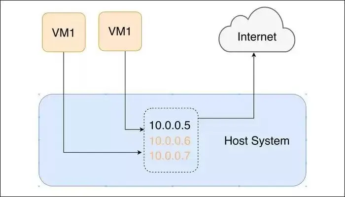

#Bridged 
Chế độ bắc cầu là tốt nhất trong số các chế độ mạng, vì đây là chế độ duy nhất không cô lập các máy ảo theo một cách nào đó. Trong chế độ Cầu nối, máy ảo của bạn giao tiếp trực tiếp với các dịch vụ bên ngoài, sử dụng giao diện mạng của máy chủ.

Điều này có nghĩa là các máy ảo sẽ xuất hiện trên bộ định tuyến của bạn dưới dạng địa chỉ IP hoàn toàn riêng biệt, mặc dù được định tuyến đến cùng một máy. Điều này cho phép bạn lưu trữ các dịch vụ trên máy ảo và truy cập chúng trên mạng cục bộ của bạn bằng địa chỉ và số cổng, giúp kết nối mạng rất linh hoạt.

Chế độ mạng này được sử dụng bởi nhiều nhà cung cấp VPS, như AWS, vì nó cho phép họ phân vùng một máy chủ mạnh lớn thành nhiều máy chủ nhỏ hơn có thể bán cho khách hàng. Mỗi máy sẽ có một địa chỉ IP duy nhất trên mạng. Mặc dù vậy, đối với các dịch vụ như AWS, nhiều biện pháp bảo vệ và hệ thống bổ sung được đưa ra để ngăn bạn truy cập vào các máy ảo của khách hàng khác và các thứ tự của nó phức tạp hơn thế này.

Mặc dù máy chủ được sử dụng để định tuyến các gói trở lại máy chủ, nhưng nó không can thiệp vào chúng theo bất kỳ cách nào, làm cho hệ điều hành khách chỉ xuất hiện như một máy tính khác trên mạng của bạn. Tuy nhiên, vì không có gì cách ly máy ảo với mạng bên ngoài, nên không có tường lửa hoặc bảo vệ cố hữu nào khác ngoài tường lửa của cổng của bạn và bất kỳ tường lửa nào được định cấu hình thủ công trên hệ điều hành khách.

Hầu hết các máy chủ sẽ có nhiều cổng ethernet và nhiều giao diện vật lý. Vì chế độ Cầu nối chỉ đơn giản là cầu nối một trong những giao diện vật lý này, nên nó có thể được sử dụng để chạy các máy ảo trên các mạng hoàn toàn riêng biệt, tùy thuộc vào hệ thống cáp trong thế giới thực của bạn.

Bạn nên chọn Mạng kết nối nếu bạn muốn toàn quyền truy cập không bị cản trở. Cũng hữu ích nếu bạn chỉ muốn chạy nhiều máy chủ “ảo” sử dụng cùng một phần cứng, giống như cách một nhà cung cấp VPS sẽ làm.