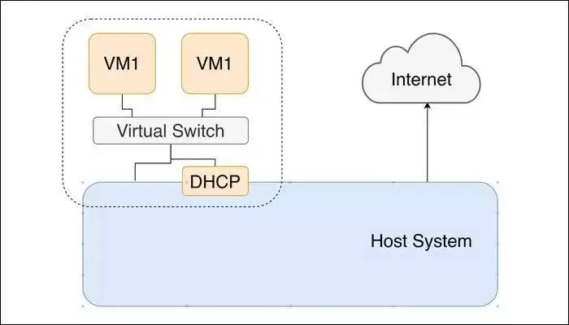

#Host-only

Trong chế độ Host-Only, các máy ảo không có cách nào để truy cập internet. Tuy nhiên, vẫn có thể giao tiếp giữa máy chủ với khách và khách với máy chủ và là lý do chính để sử dụng chế độ này.

Trong chế độ này, một máy chủ DHCP thường được chạy để cung cấp địa chỉ IP cho khách và giao tiếp giữa khách với khách cũng dễ dàng bằng cách sử dụng mạng internet.

Bạn nên chọn chế độ Chỉ Máy chủ lưu trữ nếu bạn cần nhiều giao tiếp hai chiều giữa máy chủ và khách nhưng không muốn truy cập internet trên máy chủ. Nếu bạn cần giao tiếp hai chiều nhưng cần truy cập bên ngoài, bạn có thể đạt được hiệu quả tương tự với chế độ bắc cầu, cho phép truy cập đầy đủ.