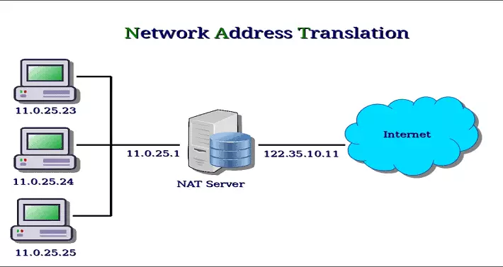

<h1 style="color: white">NAT là gì ?</h1>

NAT (Network Address Translation) – là một kỹ thuật có phép chuyển đổi từ một địa chỉ IP này thành một địa chỉ IP khác. Network Address Translation giúp địa chỉ mạng cục bộ (Private) truy cập đến mạng công cộng (Internet). Vị trí thực hiện NAT là Router biên, nơi kết nối hai loại mạng này.

NAT là hình thức Network Translation phổ biến nhất liên quan đến một private network sử dụng các địa chỉ trong range private (10.0.0.0 đến 10.255.255.255, 172.16.0.0 đến 172.31.255.255 hoặc 192.168.0 0 đến 192.168.255.255). Địa chỉ private hoạt động tốt cho các máy tính chỉ phải truy cập tài nguyên trong mạng.

Như máy trạm cần truy cập vào máy chủ file và máy in. Router trong mạng riêng có thể định tuyến lưu lượng giữa các địa chỉ private mà không gặp sự cố. Tuy nhiên, để truy cập các tài nguyên bên ngoài mạng, như Internet, các máy tính này phải có địa chỉ public và đây được xem là nơi NAT phát huy tác dụng.

<h1 style="color: white">Hoạt động của NAT</h1>

Trong một hệ thống, NAT có nhiệm vụ thực hiện truyền gói tin từ lớp mạng này sang lớp mạng khác. Ở đó, NAT sẽ thực hiện việc thay đổi địa chỉ IP bên trong gói tin và sau đó chuyển qua router và các thiết bị mạng khác. Trong quá trình gói tin được truyền từ mạng internet về NAT thì NAT sẽ thực hiện thay đổi địa chỉ IP đích thành địa chỉ IP mạng cục bộ (Private) trong hệ thống rồi mới chuyển đi.

Với cách thức hoạt động như vậy, cho thấy NAT đóng vai trò rất quan trọng, giúp bảo vệ đucợ các thông tin liên quan đến địa chỉ IP của máy tính. Nếu xảy ra tình trạng mất kết nối internet thì địa chỉ IP (Public) sẽ thay thế cho địa chỉ IP (Private).

<h1 style="color: white">Ứng dụng của NAT</h1>

Có nhiều cách sử dụng khác nhau cho NAT. Ngoài việc đơn giản là cho phép các máy trạm có địa chỉ IP (Private) truy cập Internet. Trong các mạng lớn, một số máy chủ trong mạng nội bộ có thể hoạt động như máy chủ Web và yêu cầu truy cập từ Internet. Các máy chủ này được gán địa chỉ IP Public trên tường lửa (Firewall). Cho phép người dùng chỉ truy cập vào máy chủ thông qua địa chỉ IP public đó.

Tuy nhiên, là một lớp bảo mật bổ sung, tường lửa hoạt động như một trung gian giữa thế giới bên ngoài (external) và mạng nội bộ bên trong (internal)
Các rule bổ sung có thể được thêm vào, bao gồm các port nào có thể được truy cập tại địa chỉ IP đó. Sử dụng NAT theo cách này cho phép các kỹ sư mạng định tuyến lưu lượng truy cập mạng nội bộ hiệu quả hơn đến cùng các tài nguyên và cho phép truy cập vào nhiều port hơn, đồng thời hạn chế quyền truy cập tại tường lửa.

Ngoài ra, NAT cũng có thể được sử dụng để cho phép truy cập có kiểm soát ra bên ngoài mạng. Máy trạm hoặc các máy tính khác cần truy cập đặc biệt bên ngoài mạng có thể được chỉ định IP public cụ thể bằng NAT. Một lần nữa, tường lửa hoạt động như một trung gian và có thể kiểm soát phiên theo cả hai hướng, kiểm soát port và prototol truy cập

Tìm hiểu NAT là gì giúp cho bạn hiểu thêm về tầm quan trọng của tường lửa. Nó tiết kiệm số lượng IP public được sử dụng trong một tổ chức. Và cho phép kiểm soát chặt chẽ hơn quyền truy cập vào tài nguyên trên cả hai mặt của tường lửa: Public (external) và Private (internal).