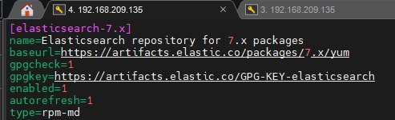
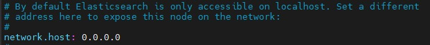
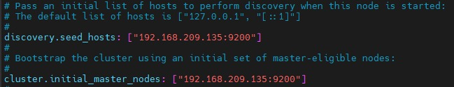
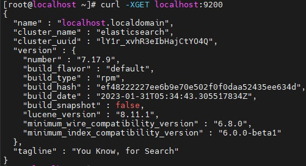
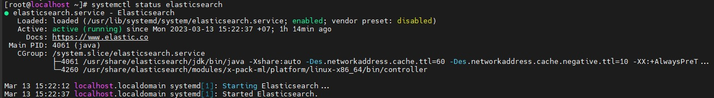
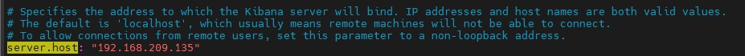

# Cài đặt Java (openjdk)

- Thực hiện cài đặt trên CentOS 7.

- Đầu tiền cần cài đặt Java:

```
yum update -y
yum install java-1.8.0-openjdk-devel -y
#kiểm tra bằng lệnh
java -version
```

# Cài đặt Elasticsearch

- Dùng phiên bản 7.x

## Thêm repo

- Vào đường dẫn `/etc/yum.repos.d/elasticsearch.repo` sau đó thêm vào file các câu lệnh:
```
[elasticsearch-7.x]
name=Elasticsearch repository for 7.x packages
baseurl=https://artifacts.elastic.co/packages/7.x/yum
gpgcheck=1
gpgkey=https://artifacts.elastic.co/GPG-KEY-elasticsearch
enabled=1
autorefresh=1
type=rpm-md
```


- Cài đặt: 

`yum install elasticsearch -y`

- Kích hoạt dịch vụ:

`systemctl enable elasticsearch.service`

`systemctl start elasticsearch.service` 

- Mở firewall cổng 9200 cho Es nếu cần:

`firewall-cmd --permanent --add-port=9200/tcp`

`firewall-cmd --permanent --add-port=9300/tcp`

`firewall-cmd --reload`

- Cấu hình network:

    + Vào theo đường dẫn: 
    
    `/etc/elasticsearch/elasticsearch.yml`

    + Sử dụng địa chỉ ip 0.0.0.0 để mọi địa chỉ IP trên máy chủ đều có thể truy cập vào:

    

    + Định danh máy chủ và node:

    

- Sau khi xong, cần khởi động lại ES: `systemctl restart elasticsearch`

    + Mặc định dữ liệu của elasticsearch được lưu  /var/lib/elasticsearch

- Kiểm tra ES 
    + Sau khi start service elasticsearch xong, bạn có thể dùng lệnh:

`curl -XGET localhost:9200`



- Kiểm tra trạng thái:

`systemctl status elasticsearch`



- Check log:

`/var/log/elasticsearch/elasticsearch.log`

# Cài đặt Kibana

- Cài đặt:

`yum install kibana -y`

`systemctl enable kibana`

- Cấu hình truy cập từ mọi IP:

    + Vào file `/etc/kibana/kibana.yml` và chỉnh sever host sang địa chỉ 0.0.0.0:

    

- Chạy kibana:

`systemctl start kibana`

- Kiểm tra kibana bằng cách truy cập đến địa chỉ IP sever với cổng là 5601:


- Kiểm tra phiên bản kibana:

`rpm -qa| grep kibana`

