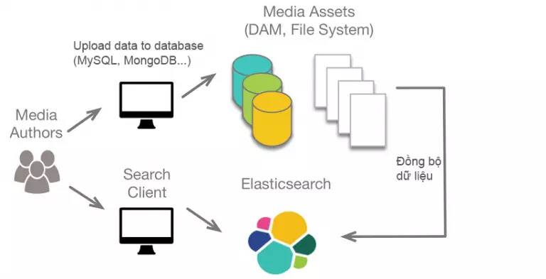

- ES là 1 full text search engine, phát triển tren nền tàng Java.
- ES hoạt động như một Cloud Server có khả năng tìm kiếm thông qua cơ chế RESful.
- Người dùng tạo ra HTTP Request và dữ liệu dạng JSON, sau đó nhập vào ES.
- Các dữ liệu đều được đánh Index ➜ Hiệu quả tìm kiếm cao
- Đầu tiên, dữ liệu được đưa vào Elasticsearch từ nhiều nguồn khác nhau, sau đó được phân tích, xử lý, trong quá trình nhập liệu. Tiếp theo, dữ liệu được phân loại và chỉ mục, được đẩy lên Server Elasticsearch. Cuối cùng, người dùng có thể tạo các truy vấn phức tạp và lấy dữ liệu được trả về từ server Elasticsearch.
