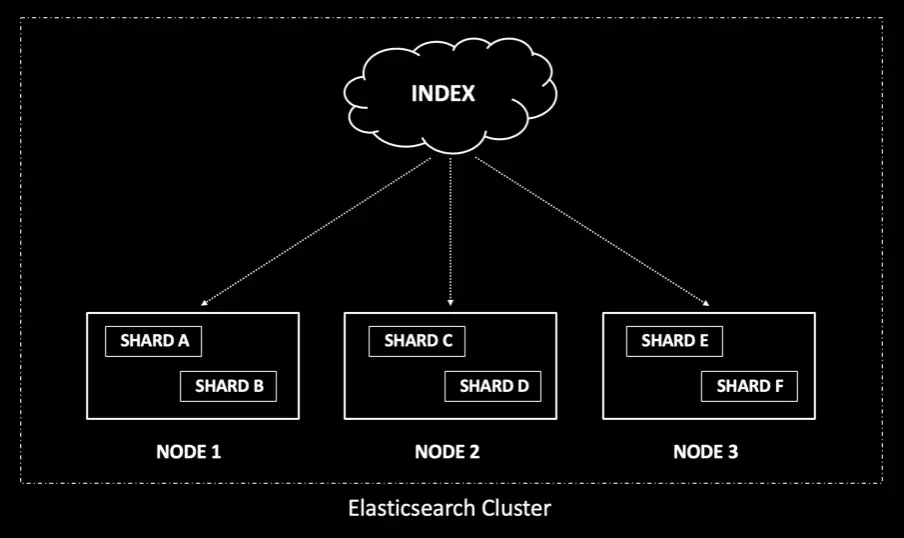
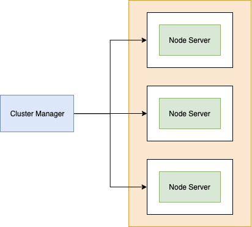

# Cluster là gì ?

- Cluster là tập hợp các nodes hoạt động cùng với nhau. Mỗi Cluster có một Node chính được lựa chọn tự động, Node này có thể thay thế.
- Định danh các Cluster trùng tên nhau sẽ gây lỗi cho các node. 

# Cơ chế hoạt động 

- Mỗi máy chủ trong cluster là một node, thiết lập ở 2 chế độ: chủ động & bị động 
    + Mode chủ động: chủ động xử lý các yêu cầu
    + Mode thụ động: nằm trong chế độ dự phòng nóng, chờ để sẵn sàng thay thế cho một node khác nếu bị hỏng 
- Trong cluster có nhiều node có thể kết hợp cả node chủ động và node thụ động.

- Các node trong cluster là một bộ phận của cùng một domain và có thể được cấu hình là máy điều khiển vùng hay máy chủ thành viên

- Mỗi node chủ động được dự phòng bởi một node thụ động, các máy chủ cần cấu hình khổi lượng công việc sử dụng khoảng 50% CPU và dung lượng bộ nhớ.

- Số node chủ động mà nhiều hơn số node thụ động, các máy chủ cần phải cấu hình CPU và bộ nhớ mạnh hơn để có thể xử lý được công việc khi một node nào đó hỏng.

- Lý tưởng nhất là mỗi Cluster nhiều node có ít nhất hai node làm máy điều khiển vùng và đảm nhiệm việc failover đối với những dịch vụ vùng thiết yếu. Nếu không như vậy thì khả năng sẵn sàng của các tài nguyên trên cluster sẽ bị phụ thuộc vào khả năng sẵn sàng của các máy điều khiển trong domain.

