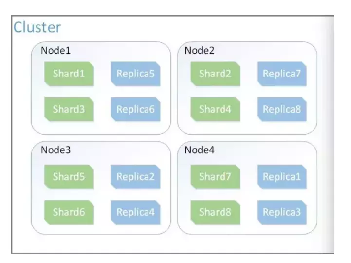
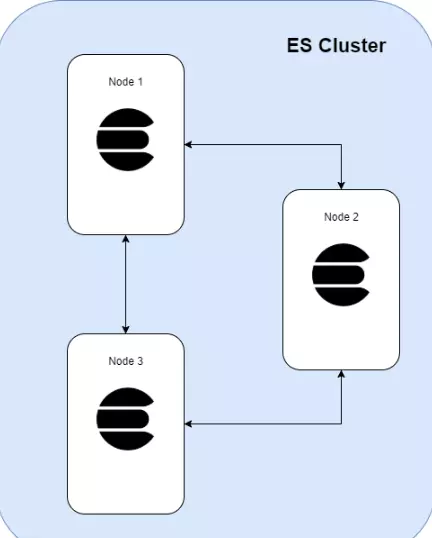
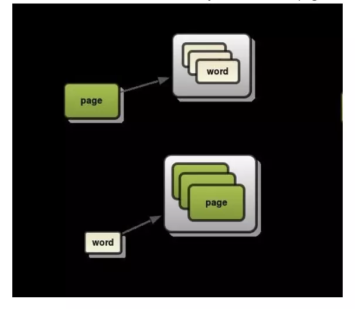
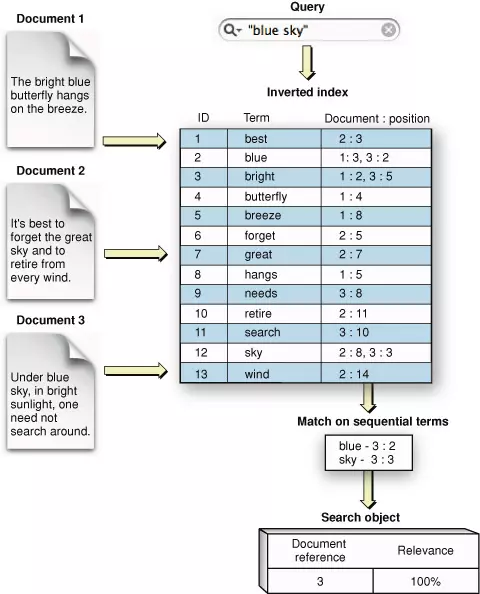
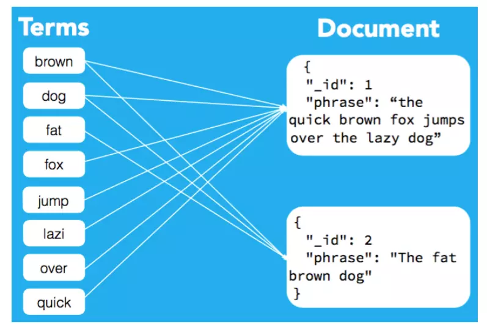

# Cluster

- Là một tập hợp các node - nơi lưu trữ toàn bộ dữ liệu, thực hiện đánh index và search giữa các node. 
-  Nếu như các cluster có tên trùng nhau sẽ dẫn tới hiện tượng các node join nhầm cluster ➜ tên của cluster phải là unique.

# Node 

- Mỗi node là 1 sever trong cluster, là nơi lưu trữ dữ liệu, có nhiệm vụ đánh index của cluster và thực hiện search.
- Mỗi node được xác định bởi một unique name của cluster đó. Mặc định là một chuỗi random uuid và được gắn giá trị ngay khi node được start.

# Index

- Chứa các document liên quan đến nhau
- Lưu cách đánh index cho document đó 
- ES tìm kiếm bởi inverted index ( ≠ forward index).

VD: Đánh phụ lục quyển sách. Cách làm phụ lục như phần trước gọi là forward index còn phần sau là inverted index.

- Dùng inverted index với các keywords. Thay vì đọc từng page để tìm kiếm, ES sẽ tìm kiếm trong keyword nên két quả sẽ trà về rất nhanh  

- Một Inverted index chứa danh sách từng từ đơn duy nhất (unique work) xuất hiện trong bất kỳ một document nào, ứng với mỗi từ đó sẽ là một danh sách các document mà từ này xuất hiện (mapping)

# Shard & replicas
- Là tập con các documents của 1 index. Một index có thể chia thành nhiều shard.
- Mỗi node bao gồm nhiều shard --> Shard là đối tượng nhỏ nhất, hoạt động ở mức thấp nhất, đóng vai trò lưu trữ dữ liệu.
- Shard: chia index thành nhiều phần nhỏ.
- Mỗi shard cũng là một index đầy đủ chức năng và độc lập do đó chúng có thể được host bởi bất kỳ node nào
- Nếu một shard bị lỗi, thì bản copy (replicas) của nó sẽ được dùng để thay thế.

# Document 

- Là đơn vị cơ bản nhất có thể đánh indxex 
- Được lưu với dạng JSON 
- Cần gán cho 1 type bên trong index

