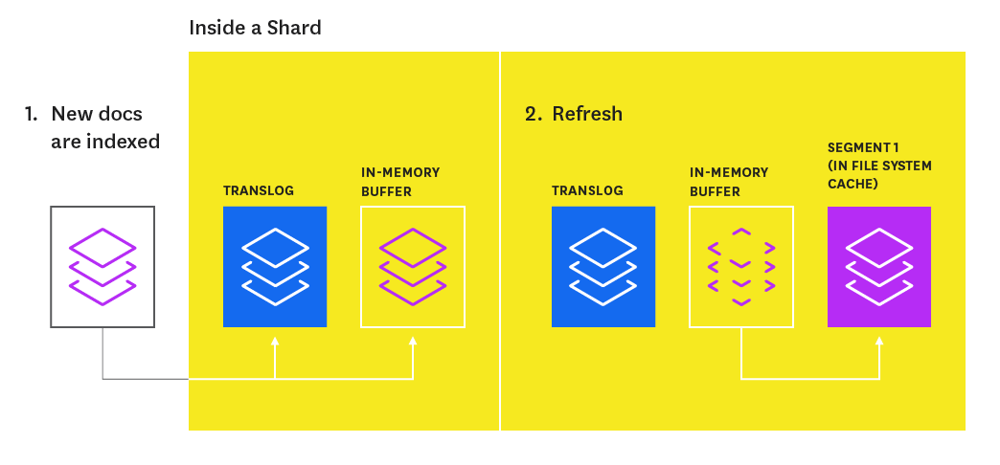
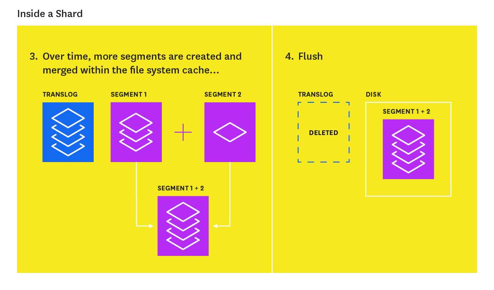

- Mỗi một index của ES có một hoặc nhiều shard (mặc đình là 5). Các shard tồn tại trên các node khác nhau.

- Một shard chứa nhiều segment và mỗi segment là một inverted index với đầy đủ chức năng. Khi thực hiện tìm kiếm trong shard thì sẽ lần lượt tìm kiếm các segment trước, sau đó kết hợp lại các kết quả tìm kiếm thành kết quả của cuối cùng của shard.

- Khi tạo index trong document, ES thu thập trong bộ nhớ, sau mỗi giây sẽ ghi một segment nhỏ mới vào đĩa và "refreshes" tìm kiếm.

- ES sẽ thường xuyên "flush", có nghĩa là đồng bộ hóa các segment và xóa các log không cần thiết vì các dữ liệu mới đã ghi vào đĩa.

- Với mỗi yêu cầu tìm kiếm, mọi segment trong một index sẽ được sử dụng, và mỗi segment sẽ hoạt động độc lập (Sử dụng CPU và bộ nhớ)
➜ Nếu có  quá nhiều segment, hiệu năng tìm kiếm sẽ bị giảm đi, nếu segment quá ít lại không tận dụng hết khả năng của máy chủ.
➜ Gộp các segment nhỏ thành các segment lớn, các segment cũ sẽ được bỏ đi. Nếu gộp tất cả các segment làm một thì sẽ làm bỏ phí rất nhiều tài nguyên khiến hiệu năng giảm.

