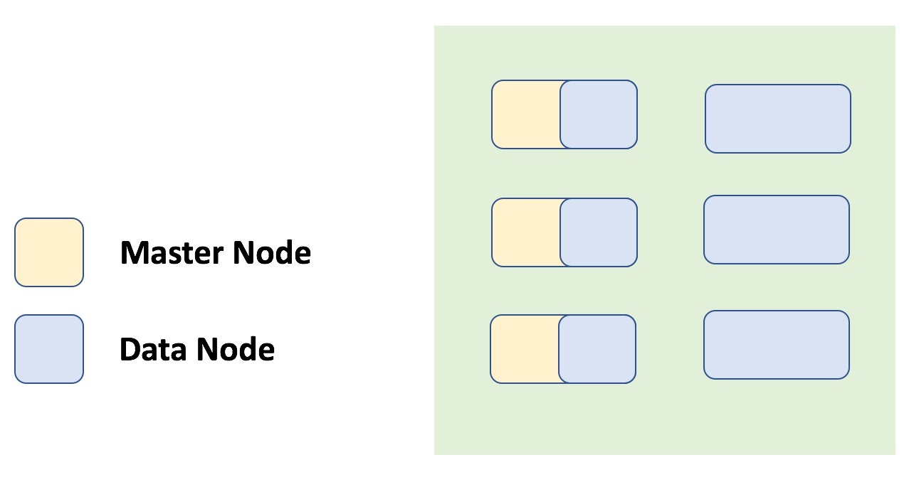
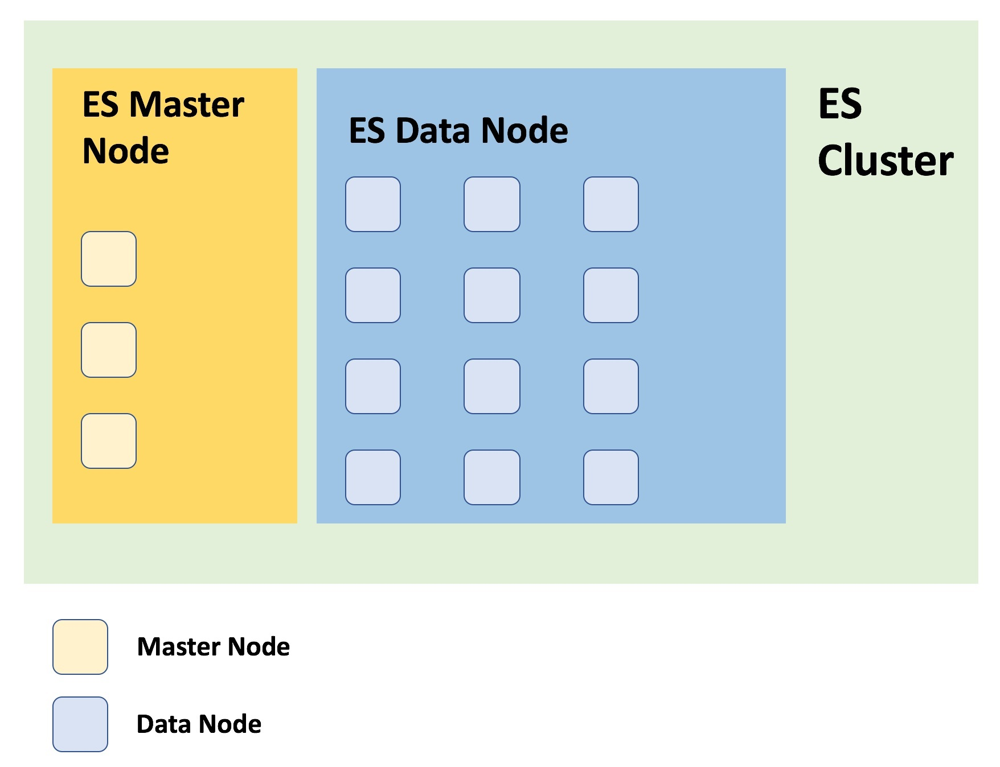

- Mặc định khi mới cài ES thì một node ES vừa là Master Node, vừa là Data Node
- Có 2 loại node chính trong ES:

# Master Node
    
- Một cluster sẽ tự động chọn ra một node làm master từ các node của nó. Chịu trách nhiệm điều phối công việc của cluster, ví dụ: phân bố các shard, tạo xóa các index,... Chỉ có node master mới có khả năng cập nhật trạng thái của cluster.
- Chỉ có 1 master node trong hệ thống, không thể có nhiều master node cùng chạy trong ES cluster.
- Được bầu chọn từ danh sách các máy chủ Master-eligible Node: Là các máy chủ ES Node được cấu hình sẵn sàng tham gia quá trình bầu chọn thành Master Node khi gặp sự cố.

# Data Node

- Là các node mà các shard được phân bố 
- Thực hiện các công việc index: tìm tài liệu, tìm kiếm và thống kê. Định tuyến các truy vấn của người dùng như index hay tìm kiếm. Có trách nhiệm chính là lưu trữ.
- Nếu một data node chết hoặc dừng hoạt động thì cluster vẫn tiếp tục vận hành và tổ chúc lại các shard index trên các node khác.
- Một cluster có thể không có node client 

# Data Node và Master Node phát hiện ra nhau bằng 2 cách

## Ping 
- Một node sẽ sử dụng kĩ thuật zen discovery (kĩ thuật mặc định ES sử dụng để khám phá/kiểm tra và giao tiếp giữa các node trong cụm phân tán) để tìm kiếm và kiểm tra các node khác. Master Node sẽ ping toàn bộ các Node trong cluster để đảm bảo tất cả các node khác đều đang chạy. Các node còn lại: Data Node, Client Node,... sẽ ping Master Node để xác định xem còn sống hay không, nếu chết thì bầu chọn lại.

## Unicast
- Yêu cầu một danh sách các host được cấu hình sẵn làm Master Node. Cần phải định nghĩa một danh sách thông tin Master-eligible Node. Điều này giúp một node mới muốn vào ES cluster thì chỉ cần kết nối đến các Master-eligible Node nằm trong phần cấu hình unicast discovery, xem ai đang là Master Node để xin vào cluster.

# Cơ chế phát hiện lỗi ở các Node trong ES Cluster

- Có hai quá trình phát hiện lỗi được chạy cùng lúc:
    + Đầu tiên là ở master Node, node này sẽ ping tất cả các Node khác trong cụm phân tán để xác minh chúng còn sống.
    + Còn lại các Node khác trừ Master Node, mỗi Node tiến hành ping Master Node để xác mình xem Master Node còn sống không, nếu không thì quá trình bầu chọn Master Node mới sẽ được bắt đầu.

# Các mô hình Master Node thường gặp 

## Mô hình 1

- Master Node gộp chung với Data Node/Client Node. Chỉ có 1 Master-eligible Node.

## Mô hình 2

- Để đảm bảo tính sẵn sàng cho Master Node, cấu hình đủ số lượng Master-eligible Node sẵn sàng tham gia quá trình bầu chọn cho Master Node mới. Con số tối ưu hợp lý thường là 3.   

## Mô hình 3

- Mô hình cần có điều kiện về phần cứng cao để đảm bảo hệ thống ES vận hành tốt. Tách Data/Client Node thành một lớp, Master Node ra làm lớp riêng và chạy đủ số lượng Master-eligible Node đảm bảo tính HA.

# Hot data node

- Là một phần của hot tier. Là điểm truy cập cho dữ liệu thời gian và chưa hầu các dữ liệu thời gian được tìm kiếm gần đây và thường xuyên nhất.
- Node trong hot tier cần phải đọc và ghi một cách nhanh chóng, đòi hỏi cần nhiều tài nguyên ổ cứng và bộ nhớ nhanh.
- Để có khả năng hồi phục, các chỉ số trong hot tier phải được cấu hình để có thể sử dụng một hay nhiều replicas.
- Hot tier là bắt buộc, các chỉ mục mới là một phần của data stream sẽ được tự động phân bổ cho hot tier.

# Warm data node

- Là một phần của warm tier. Dữ liệu chuỗi thời gian có thể chuyển sang warm tier sau khi nó ít được truy vấn thường xuyên so với dữ liệu được lập chỉ mục gần đây trong hot tier.
- Warm tier thường chứa dữ liệu vài tuần gần nhất, cho phép cập nhật những không thường xuyên.
- Các node ở warm tier không cần phải nhanh như ở hot tier.
- Để có khả năng phục hồi, các chỉ mục mới trong warm tier phải được cấu hình để có thẻ sử dụng một hay nhiều replicas.

# Ingest node

- Thực thi các pipelines, bao gồm một hoặc nhiều bộ xử lý tùy thuộc vào hiệu năng được thực hiện bởi bộ xử lý nhập và các tài nguyên cần thiết.
- Có thể có các ingest node chuyên dụng, các node này chỉ có thể thực hiện các tác vụ cụ thể của nó.

