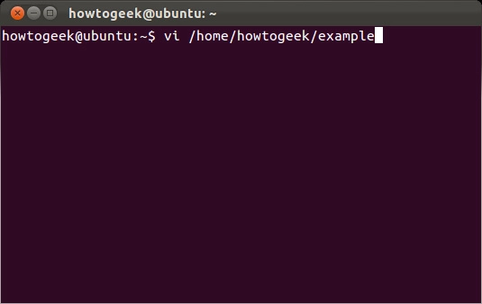
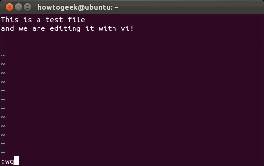
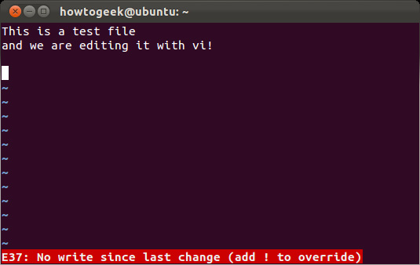

# Vi là gì?

Vi là một trình chỉnh sửa dành cho Linux, Unix và các hệ điều hành giống Unix khác. Vi là viết tắt của visual instrument. Nó là một trình soạn thảo văn bản mặc định được sử dụng rộng rãi cho các hệ thống dựa trên Unix và đi kèm với tất cả các phiên bản Unix. Nó chỉ sử dụng bàn phím và cung cấp một giao diện rất hiệu quả để chỉnh sửa những chương trình và script.

Không giống như các trình xử lý văn bản dựa trên Windows phổ biến rộng rãi (chẳng hạn như Notepad và Word của Microsoft), Vi không cung cấp bất kỳ khả năng định dạng nào.

Vi thực sự có một trình chỉnh sửa cơ bản được gọi là ex. Vi là chế độ trực quan của ex. Để thực hiện các lệnh vốn có đối với trình soạn thảo dòng lệnh cũ, dấu hai chấm (:) được sử dụng. Ngoài ra còn có hai chế độ hoạt động chính: Chế độ lệnh và chế độ chèn. Để quay lại chế độ lệnh, chỉ cần nhấn phím ESC.

# Mở Vi trên Linux

Dùng cú pháp vi /path/to/file để mở file text có sẵn bằng Vi, và lệnh đó cũng sẽ hoạt động nếu file text được chỉ định không có sẵn, thay vào đó Vi sẽ tự tạo ra file text với tên như vậy.

Lưu ý rằng nếu cần phải dùng lệnh sudo nếu muốn chỉnh sửa file hệ thống. Hệ điều hành không phải Ubuntu của Linux thì thay thế sudo bằng su.

# Chế độ Command

Khi ở trong chế độ Command, có thể di chuyển con trỏ bằng cách nhấn phím mũi tên, nhấn x để xóa ký tự ngay dưới con trỏ, còn nhấn dd để xóa toàn bộ dòng ký tự. Bên cạnh đó, các bạn có thể lựa chọn, copy, cut và lưu đoạn text trong chế độ này. Di chuyển con trỏ sang bên trái hoặc phải của ký tự cần copy và nhấn phím v, nhấn x để cắt đoạn text, sau đó đặt con trỏ vào vị trí cần di chuyển đoạn text và nhấn p để paste.

# Chế độ Insert

Đây là chế độ hoạt động của Vi cho phép người dùng chèn thêm ký tự vào văn bản. Chỉ cần nhấn nút i là đã chuyển sang chế độ Insert sau khi xác định vị trí con trỏ trong chế độ Command

Khi nhập xong đoạn nội dung cần thiết, nhấn phím Esc để quay về chế độ Command.

# Saving & Quiting

Lưu và thoát ứng dụng trong chế độ Command (nhấn Escape để chắc chắn rằng đã ở trong chế độ này). Gõ :wq để lưu file sau khi thay đổi và đóng vi, hoặc thực hiện riêng rẽ thành 2 công đoạn, :w để lưu file và :q để thoát chương trình mà không lưu lại thay đổi:

Nhưng Vi sẽ không cho người dùng đóng ứng dụng nếu đã thay đổi từ lần lưu cuối cùng, gõ lệnh :q! Và nhấn Enter để bỏ qua cảnh báo này:

# Mở file trong vi

- vi file: Tạo một file mới nếu nó không tồn tại. Nếu không, nó sẽ mở file hiện có.

- vi -R file: Chế độ chỉ đọc (Read only)

# Di chuyển giữa các ký tự

- Phải ở chế độ Command.
Bạn có thể sử dụng các phím: Mũi tên lên, xuống, trái và phải.

| Lệnh | Mô tả |  
| :----- | :---------- | 
| k      | Đưa con trỏ lên trên           |               
| j     | Đưa con trỏ xuống dưới           |                
| h     | Đưa con trỏ sang trái           |               
| i      | Đưa con trỏ sang phải           |              

# Các lệnh thông thường trong vi

| Lệnh | Mô tả |  
| :----- | :---------- | 
|i|Chèn văn bản trước vị trí con trỏ hiện tại |
|l|Chèn văn bản ở đầu dòng hiện tại|
|a|Chèn văn bản ở sau vị trí con trỏ hiện tại|
A|Chèn văn bản ở cuối dòng hiện tại|
|o|Tạo một dòng mới cho mục nhập văn bản trên dưới con trỏ|
|O|Tạo một dòng mới cho mục nhập văn bản ở trên con trỏ|
|x|Xóa ký tự bên dưới con trỏ|
|X|XÓa ký tự trước con trỏ|
|dd|Xóa dòng con trỏ đang được đặt|
|cc|Xóa nội dung của dòng, để người dùng ở chế độ Insert|
|r|Thay thé ký tự bên dưới con trỏ|

# Lệnh vi nâng cao

| Lệnh | Mô tả |  
| :----- | :---------- | 
|<<|Tham gia vào dòng tiếp theo|
|>>|Căn dòng hiện tại sang bên trái với một chiều rộng có thể thay đổi|
|:nr file|Đọc file và chèn nó sau dòng n.|
|~|Chuyển đổi kiểu viết hoa/viết thường của ký tự bên dưới con trỏ.|
|^G|Nhấn các phím CTRL và G cùng một lúc để hiển thị tên file và trạng thái hiện tại.|
|U|Khôi phục dòng hiện tại về trạng thái trước khi con trỏ nhập vào dòng.|
|u|	Hoàn tác thay đổi cuối cùng đối với tệp. Nhập lại "u" một lần nữa sẽ thực hiện lại thay đổi.|
|J|	Tham gia vào dòng hiện tại và dòng tiếp theo. Một số tham gia vào nhiều dòng.|
|:f|	Hiển thị vị trí hiện tại trong tệp bằng % và tên file, tổng số file.|
|:f filename|Đổi tên file hiện tại thành filename.|
|:w filename|Viết vào filename của file.|
|:e filename|Mở một file khác với filename.|
|:cd dirname|Thay đổi thư mục làm việc hiện tại thành dirname.|
|:e #|​Sử dụng để chuyển đổi giữa 2 file đã mở.|
|:n|	Trong trường hợp bạn mở nhiều file bằng Vi, hãy sử dụng :n để chuyển đến file tiếp theo trong chuỗi.|
|:N|Trong trường hợp bạn mở nhiều file bằng vi, hãy sử dụng :N để chuyển đến file trước đó trong chuỗi.|
|:r file|	​Đọc file và chèn nó sau dòng hiện tại|

