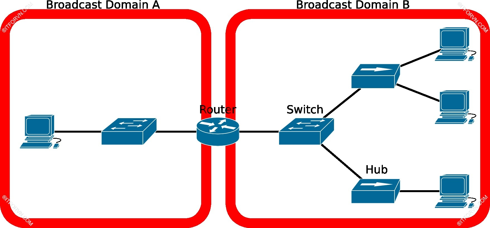

<h1 style="color: yellow">1. Tổng quan về Ethernet LAN.</h1>

<h2 style="color: yellow">Định nghĩa Ethernet LAN.</h2>

- Trong một hệ thống mạng enterprise bao gồm nhiều branch, hoạt động nhiều thiết bị end users như PC, server, laptop, mobile phone. Thường được kết nối với nhau bằng một hệ thống mạng LAN. Mỗi một hệ thống mạng LAN lại được kết nối vào một đường WAN để kết nối giữa các branch và kết nối ra Internet.

- Một số cấu trúc LAN điển hình như: Token Ring, FDDI, Ethernet LAN. Tuy nhiên được biết đến và sử dụng nhiều nhất là kiến trúc Ethernet LAN. Một kiến trúc Layer 2 được sử dụng rộng rãi trong hệ thống mạng ngày nay.

- Kiến trúc data-link của một Ethernet LAN.

<h2 style="color: yellow"> Địa chỉ MAC sử dụng trong Ethernet LAN.</h2>

Địa chỉ phần cứng được sử dụng trong Ethernet LAN (hardware address hay physical address) được biết đến với tên gọi địa chỉ MAC. MAC address gồm 48 bit nhị nhân thường biểu diễn dưới dạng hexa. Địa chỉ này là duy nhất cho từng thiết bị. Không trùng với bất cứ thiết bị nào trên thới giới.

Cấu trúc của một địa chỉ MAC:

<h2 style="color: yellow"> Hub, Switch, Half – Duplex, Full – Duplex, Collision Domain, Broadcast Domain trong một hệ thông mạng LAN.</h2>

<h3 style="color: yellow">  Mô hình đấu nối dạng Bus trong mạng LAN.</h3>

- Mô hình đại diện cho Ethernet LAN trong giai đoạn đầu, đấu nối bằng cáp đồng trục sử dụng các chuẩn như 10Base2(10Mbps – 200m), 10Base5(10Mbps – 500m).

- Cách thức hoạt động của mô hình bus: khi một máy gửi đi một frame, frame này sẻ được truyền đến mọi thiết bị trong mô hình đang kết nối vào. Các thiết bị nhận sẻ quan sát trường Destination Address trong frame này, nếu đây không phải là frame gửi đến cho mình các thiết bị nhận sẻ drop frame này. Địa chỉ nào có MAC là Dest.Address của frame mới tiếp nhận và xử lí frame.

- Ví dụ : khi máy MAC II gửi đi một frame đến host workstation thì tất cả các host khác đều nhận được frame này nhưng chỉ có host Workstation mới có đúng Dest Address MAC và tiếp nhận xử lí frame.

<h3 style="color: yellow">  Mô hình đấu nối dạng Hub trong mạng LAN.</h3>

- Sử dụng chuẩn LAN 10 BASE T sử dụng cáp xoắn đôi để kết nối các thiết bị đầu cuối. Đây là một mô hình dạng Star topology, một thiết bị tập trung HUB sẻ thực hiện kết nối các thiết bị này lại với nhau. Đảm nhận vai trò trung chuyển các dữ liệu trao đổi giữa các host đầu cuối.

- Hoạt động của HUB: Hub thực hiện nhân bản các gói tin và gửi ra các cổng còn lại, trong mô hình trên.

- Khi host A gửi một frame đến host B, hub sẻ tiến hành nhân bản frame này rồi đẩy ra tất cả các port, Host B và C đều nhận được frame này. Nhưng chỉ có Host B tiếp nhận và xử lý frame vì nó là địa chỉ đích được nhận frame. Mô hình này hoạt động về cơ bản cũng giống như mô hình đấu nối dạng bus.

<h3 style="color: yellow">Collision Domain của một mạng LAN.</h3>

- Xét mô hình bus hay mô hình đấu nối hub. Nếu có 2 thiết bị cùng gửi đồng thời frame vào đường truyền. Sẻ xảy ra lỗi do 2 tín hiệu của 2 thiết bị này gây nhiễu cho nhau và gây ra mất frame, lỗi bit. Gây ra xung đột tín hiệu (collision). Phương pháp khắc phục đề ra là một thiết bị chỉ được gửi khi lắng nghe đường truyền và tiếp nhận dữ liệu, đường truyền rảnh thì mới được phép truyền nếu không sẻ gây ra xung đột đường truyền.

- Phương thức này được gọi là half-duplex chỉ truyền hoặc nhận dữ liệu tại một thời điểm.

- Băng thông kết nối sẻ được chia đều trên các thiết bị đấu nối vào hệ thống LAN. Ví dụ băng thông của hệ thống là 15Mbps có 5 thiết bị trên mô hình thì mỗi thiết bị chỉ có thể truyền với tốc độ 3Mbp.

- Hệ thống Hub đấu nối các thiết bị và tạo thành một miền có khả năng xung đột tín hiệu các thiết bị trong miền này nếu truyền đồng thời. Được gọi là một Collision Domain.

<h3 style="color: yellow">Định Nghĩa về CSMA/CD một mạng LAN.</h3>

- CSMA/CD là một giải thuật để tránh xảy ra xung đột tín hiệu trong một Collision Domain. Cách thức hoạt động như sau:

    - Nếu muốn truyền đi một frame thì thiết bị này phải thực hiện lắng nghe đường truyền xem có rảnh không. Không có tín hiệu nào đang được truyền thì mới bắt đầu truyền.
    - Nếu đường truyền “bận” thì thiết bị sẻ không thực hiện truyền frame đi và ngược lại.
    - Giả xử tại thời điểm có 2 thiết bị đang lắng nghe đường truyền và biết rằng đường truyền đang rảnh. Và khi tiến hành truyền sẻ gây ra collision.
    - Khi đó tất cả thiết bị sẻ gửi một tín hiệu jamming. Để thông báo đang có collision đang xảy ra.
    - Sau khi gửi jamming. Mỗi thiết bị sẻ khởi tạo một timer ngẩu nhiên để lắng nghe lại đường truyền. Timer khởi tạo một cách ngẩu nhiên nên sẻ xảy ra việc 2 thiết bị trùng một timer là rất ít. Từ đó sẻ tránh được collision.

<h3 style="color: yellow">Thiết bị Switch của mạng LAN và định nghĩa một  Broadcast Domain.</h3>    

- Một thiết bị được phát triển từ thiết bị HUB để hạn chế Collision Domain. Và mở rộng được số lượng user và chiều dài vật lý. Từ đó tăng thêm băng thông cho các end users.

- Switch là một thiết bị Layer 2 thực hiện chuyển tiếp frame dựa vào địa chỉ MAC của frame. Mỗi port của Switch là một Collision Domain. Hình trên chỉ ra một Collision Domain lớn được chia thành 2 Collision Domain nhỏ độc lập. Các thiết bị trong một Collision Domain có thể xảy ra xung đột với nhau nhưng sẻ không xảy ra xung đột với Collision Domain còn lại. Từ đó sẻ nâng tốc độ của mỗi user lên.

- Nếu user được đấu nối điểm điểm có thể truyền và nhận đồng thời (full duplex) host này sẻ tắt đi tính năng CSMA/CD.

<h3 style="color: yellow">Broadcast Domain của một Ethernet LAN.</h3>  

- Ethernet LAN hỗ trợ phương thức truyền broadcast. Khi một host muốn gửi cùng một frame đến các host còn lại. Nên không cần phải đóng nhiều frame khác nhau. Chỉ cần đóng 1 frame broadcast chứa thông tin cần gửi và đưa lên hệ thống switch. Hệ thống sẻ nhân bản gói tin này và forward đến tất cả các host trong mạng LAN. Điều này làm giảm thiểu tiêu thụ băng thông đường truyền trong mạng LAN.

- Địa chỉ MAC được sử dụng cho hoạt động gửi broadcast có 48 bit 1 được bật lên dạng hexa FFFF.FFFF.FFFF.

- Hệ thống đơn switch hoặc nhiều switch kết nối cùng với các thiết bị có thể gửi broadcast cho nhau trong hệ thống. Tạo thành một miền broadcast domain.

- Các miền broadcast domain thường được kết nối với một interface của Router. Để nhờ Router định tuyến mà các broadcast domain này có thể đi đến nhau.

- Mặc định trên các cổng của Router sẻ drop gói tin broadcast nên các gói tin này chỉ được gửi nội bộ trong miền broadcast domain. Mà không thể lan truyền qua vùng broadcast domain khác được. Router góp phần chống xảy ra hiện tượng “broadcast storm”. Khi đó mỗi cổng của Router thực hiện send/receive data cho một broadcast domain.

<h1 style="color: yellow">2. Cách thức hoạt động chuyển mạch của một Ethernet Switch trong một hệ thống mạng LAN.</h1>  

- Nhiệm vụ chính của một Ethernet switch là thực hiện hoạt động chuyển mạch. Khi frame đi vào một cổng của switch. Nó sẻ thực hiện chuyển tiếp để frame này đi đến được thiết bị nhận. Để thực hiện chuyển mạch đúng switch dựa vào một bảng thông tin gọi là bảng MAC (MAC Address Table) hay bản CAM(Content Addressable Memory). Để chuyển mạch được đúng. Switch phải cập nhật được chính xác định chỉ MAC của các host trên các cổng của nó vào bảng MAC. Sau đó dựa vào bảng MAC này để thực hiện việc chuyển mạch.

Khi lần đầu được bật lên bảng MAC của switch chưa có thông tin gì, khi đó nó sẻ thực hiện các bước sau để xây dựng một bảng MAC:

- Học địa chỉ MAC và đưa vào bảng MAC. Thực hiện học địa chỉ MAC của các thiết bị end users và điền vào bảng MAC từ source MAC của Ethernet frame khi frame này đi vào một cổng nào đó của Switch.
- Chuyển tiếp (forward) frame ra một cổng thích hợp. Switch sẻ thực hiện chuyển tiếp frame nhận được từ từ một cổng dựa vào destination MAC tương ứng của frame.
    + Nếu destination MAC của frame là một địa chỉ unicast MAC có sẳn trong bảng CAM. Switch sẻ thực hiện chuyển tiếp frame này ra port tương ứng địa chỉ MAC trong bảng CAM.

    + Nếu destination MAC của frame là một địa chỉ unicast MAC chưa có sẳn trong bảng MAC hoặc một địa chỉ broadcast MAC. Switch sẽ tự đông nhân bản frame này và flood ra tất cả các port trừ port nhận vào.

- Địa chỉ unicast MAC là địa chỉ được gán trên card Ethernet LAN của các thiết bị – tức là địa chỉ physical address của thiết bị.

Khi Host 1 gửi một frame cho host 2 với source MAC host 1 : 0050.7F27.4E21 và destination MAC là MAC của host 2 0050.7F33.31F9 khi nhận được frame này thì switch sẻ xử lí:

- Switch sẻ tiến hành quan sát Destination MAC trong header của frame để đưa ra quyết định. Dò bảng CAM thì thấy rằng Destination MAC( MAC host2) chưa có trong bảng MAC. Tiếp theo switch sẻ tiến hành nhân bản frame này và flood ra tất cả các port trừ port nhận vào. Khi đó host 2 và 3 đều nhận được frame này. Nhưng chỉ có host 2 tiến hành xử lí vì frame này được gửi đến nó. Khi host3 sẻ tiến hành drop frame này.
- Switch cũng tiến hành học địa chỉ source MAC của thiết bị gửi frame này và cổng nhận frame vào và điền vào bảng MAC (hình trên).
- Thiết bị Switch về cơ bản hoạt động cũng tương tự thiết bị Hub. Nhưng được nâng cấp hơn là có thể học địa chỉ source MAC và điền vào bảng MAC. Để tiến hành forward khi cần thiết. Làm giảm quá trình xử lí frame,nâng tốc độ truyền dữ liệu.

Khi host 2 nhận được một frame. Nó cũng tiến hành trao đổi thông tin lại với host 1 bằng cách thiết lập một frame có source MAC là địa chỉ MAC host 2 và destination MAC là địa chỉ MAC host 1. Và khi switch nhận được frame này nó cũng tiến hành forward và học địa chỉ MAC này và điền vào MAC address table.

Quá trình ứng xử của switch khi nó nhận được frame gửi từ host 2 sang host 1:

- Tiến hành đọc Destination MAC của frame. Khi thấy Destination MAC là 0050.7F27.4E21. Switch sẻ quét dữ liệu trong bảng CAM và thấy nó là MAC của host 2 và nhận được từ cổng E0/1. Nên sẻ tự động forward frame này ra cổng E0/1 mà không tiến hành flood ra tất cả các port như lần xử lí frame trước đây.
- Và Switch cũng tiến hành điền MAC host 2 (0050.7F33.31F9 ) nhận được từ host 2 port E0/2 vào bảng MAC.
-Sau tất cả các quá trình trao đổi của các host. Tất cả các MAC sẻ được Switch học được và điền vào bảng CAM.

-Hoạt động chính của Switch:

- Switch học địa chỉ MAC từ source MAC của frame khi nó đi vào một interface và điền vào bảng MAC của nó.
- Switch tiến hành forward frame dựa theo Destination MAC của frame.

-Nếu frame là một địa chỉ unicast MAC chưa có trong bảng CAM hoặc một broadcast MAC. Thì switch sẻ tiến hành nhân bản frame và flood ra tất cả các port trừ port nhận vào.

-Nếu địa chỉ MAC của frame này đã được ghi trong bảng MAC. Thì switch sẻ tiến hành forward frame dựa theo các port tương ứng học được có trong bảng MAC.   