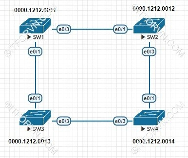
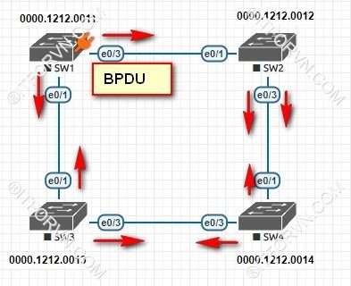
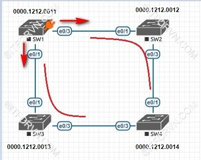

<h1 style="color: yellow">1. Tiến trình bầu chọn và hoạt động của Giao thức Spanning Tree</h1>

Hoạt động bầu chọn của một tiến trình STP :

- Thực hiện bầu chọn Root-Bridge
- Bầu chọn Root-Port
- Lựa chọn các Designated-port
- Blocking các port còn lại

<h2 style="color: yellow">Chọn Root-Bridge của Giao thức Spanning Tree</h2>

- Một khi tiến trình STP được bật, các Sw sẻ gửi các gói tin BPDU (Bridge Protocol Data Unit) để trao đổi giữa các Switch với nhau, BPDU là một gói tin quan trọng trong tiến trình STP, BPDU chứa một thông tin quan trọng là Bridge-ID của các switch, giá trị này dùng để dịnh danh mỗi Switch khi náo tham gia tiến trình STP.

Bridge-ID dài 8byte:

- Số Priority(2byte): có giá trị từ 0 – 65535 mặc định là 32768
- MAC address(6byte)

Tiến trình bầu chọn Root-Bridge sẻ tiến hành như sau:

- Đầu tiên sẻ so sánh Sw nào có số Priority thấp nhất sẻ là Root-Bridge
- Các Sw được thiết lập số Priority bằng nhau thì tiến trình thứ 2 là so sánh MAC sẻ thực hiện, Sw nào có MAC nhỏ nhất sẻ làm Root-Bridge. MAC là địa chỉ duy nhất trên thế giới nên sẻ không xảy ra trùng lập được. VD như hình trên SW1 có MAC nhỏ nhất nên sẻ được bầu chọn làm Root-Bridge.
- Sau khi đã bầu chọn được Root-Bridge thì chỉ có SW làm root mới gửi BPDU ra khỏi cổng để duy trì tiến trình STP ( gửi 2s/lần). Các SW con chỉ nhận, bổ xung thông tin BPDU và forward thông tin BPDU này.

<h2 style="color: yellow">Bầu chọn Root-Port của Giao thức Spanning Tree</h2>

- Sau khi đã bầu chọn Root-bridge các SW sẻ bầu chọn Root-port, Root-port là port có đường về Root-bridge có tổng cost tích lũy nhỏ nhất.

Mỗi interface của Ethernet LAN đều gán một giá trị gọi là cost, để thực hiện tính toán của STP.

- Để xác định được cost tích lũy của một port đến Switch làm Root-bridge ta thực hiện tính ngược từ Root về cổng đó theo qui tắc “vào cộng ra không cộng” dựa theo chiều lan truyền BPDU. VD:

Trên hình: SW1 đã làm Root-bridge nên ta sẽ tiến hành bầu chọn Root-port:

- SW2 ta tính cost trên cổng e0/1 sẻ là 100, trên cổng e0/3 sẻ là 300 nên cổng e0/1 sẻ được chọn là Root-port trên SW2.
- Tương tự trên SW3 là e0/1.
- Trên SW ta sẻ thấy e0/1 và e0/3 đều có tổng cost là 200 nên SW4 sẻ xem đường đấu nấu giữa 2 port này đến 2 Sw2 và Sw3, SW nào có MAC thấp hơn sẻ được ưu tiên hơn(giả sử default priority). Như vậy e0/1 sẻ được bầu chọn làm Root-port trên SW4.